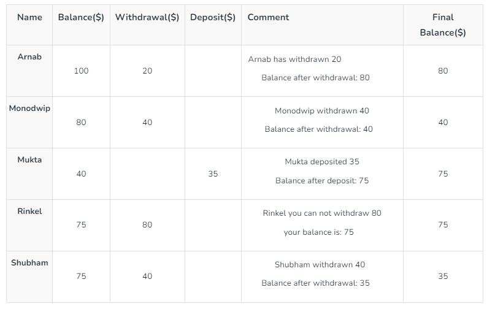

We will discuss the architecture of the banking transaction system using java. Throughout this editorial, I will hold your hands and take you through the entire transaction procedure and make it Easy-Pease for you to understand so that you can even explain it to your friends. For the sake of simplicity, we have considered a joint bank account having 5 owners(Arnab, Monodwip, Mukta, Rinkel, and Shubham) and the initial balance is a hundred dollars ($100). The transactions of the account are listed as follows:

